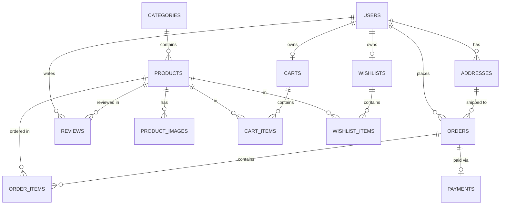

# JPBazaar Development Walkthrough

---

## Phase 1 — Database Architecture

### 1. ER Diagram & Entity Relationships



### 2. Table Schema Definitions (`sql/schema.sql`)
The PostgreSQL schema is established in [`sql/schema.sql`](file:///c:/Users/admin/Desktop/E-COMMERCE/sql/schema.sql) with 13 normalized tables and 15 secondary indexes.

---

## Phase 2 — Spring Boot Foundation

### 1. Maven Configuration (`pom.xml`)
Established Spring Boot 3.3.4 project targeting Java 21 LTS with dependencies:
- `spring-boot-starter-web`
- `spring-boot-starter-data-jpa`
- `spring-boot-starter-security`
- `spring-boot-starter-validation`
- `spring-boot-starter-data-redis`
- `postgresql` (runtime)
- `jjwt-api`, `jjwt-impl`, `jjwt-jackson` (0.12.6)
- `springdoc-openapi-starter-webmvc-ui` (2.6.0)
- `spring-boot-starter-test` & `spring-security-test`

### 2. Package Structure (`com.jpbazaar`)
```
com.jpbazaar
├── config       # OpenApiConfig, SecurityConfig, RedisConfig, JPAConfig
├── controller   # HealthCheckController, AuthController, etc.
├── service      # Business logic & transaction boundaries
├── repository   # Spring Data JPA repositories
├── entity       # JPA domain model
├── dto          # ApiResponse<T>, Request/Response records
├── mapper       # Entity <-> DTO converters
├── security     # JWT filters & SecurityContext utilities
├── exception    # Global exception handler
└── util         # AppConstants
```

### 3. Profile-Based Configuration & Secret Management
- `application.yml`: Base configuration externalized strictly to environment variable placeholders (`DB_URL`, `DB_USERNAME`, `DB_PASSWORD`, `REDIS_HOST`, `REDIS_PORT`, `JWT_SECRET`) without hardcoded secrets.
- `.env.example`: Safe local development environment template file.
- `.gitignore`: Excludes all `.env` files, build targets, and IDE settings from git commits.
- `application-dev.yml`: SQL formatting & debug logging enabled for local development.
- `application-test.yml`: H2 in-memory mode enabled for fast unit testing.

### 4. Build & Test Verification
Run via Maven:
```bash
mvn clean test
```
**Output**: `BUILD SUCCESS`, 1/1 context test passed in 9.6 seconds.

---

## Phase 3 — Entity Layer

### 1. Implemented JPA Domain Entities
Implemented 13 JPA entities in `com.jpbazaar.entity`:
1. **`User`**: `@Entity`, `@Table(name = "users")`, 1:N `Address`, 1:1 `Cart`, 1:1 `Wishlist`, 1:N `Order`, 1:N `Review`.
2. **`Address`**: `@Entity`, N:1 `User`.
3. **`Category`**: `@Entity`, 1:N `Product`.
4. **`Product`**: `@Entity`, `@Version` (`Long version` for optimistic locking in Phase 13), N:1 `Category`, 1:N `ProductImage`, 1:N `Review`.
5. **`ProductImage`**: `@Entity`, N:1 `Product`.
6. **`Cart`**: `@Entity`, 1:1 `User`, 1:N `CartItem`.
7. **`CartItem`**: `@Entity`, N:1 `Cart`, N:1 `Product`. Unique constraint on `(cart_id, product_id)`.
8. **`Wishlist`**: `@Entity`, 1:1 `User`, 1:N `WishlistItem`.
9. **`WishlistItem`**: `@Entity`, N:1 `Wishlist`, N:1 `Product`. Unique constraint on `(wishlist_id, product_id)`.
10. **`Order`**: `@Entity`, N:1 `User`, N:1 `Address`, 1:N `OrderItem`, 1:1 `Payment`.
11. **`OrderItem`**: `@Entity`, N:1 `Order`, N:1 `Product`. Historical snapshot of `productName` and `price`.
12. **`Payment`**: `@Entity`, 1:1 `Order`. Unique `transactionId`.
13. **`Review`**: `@Entity`, N:1 `User`, N:1 `Product`. Unique constraint on `(user_id, product_id)`.

### 2. Supporting Domain ENUMs
- **`Role`**: `CUSTOMER`, `ADMIN`
- **`OrderStatus`**: `PLACED`, `CONFIRMED`, `PROCESSING`, `SHIPPED`, `OUT_FOR_DELIVERY`, `DELIVERED`, `CANCELLED`
- **`PaymentMethod`**: `CARD`, `UPI`, `NET_BANKING`, `COD`
- **`PaymentStatus`**: `PENDING`, `SUCCESS`, `FAILED`, `REFUNDED`

---

## Phase 4 — Repository Layer

### 1. Implemented Spring Data JPA Repositories (`com.jpbazaar.repository`)
1. **`UserRepository`**: `findByEmail`, `existsByEmail`.
2. **`AddressRepository`**: `findByUserId`, `findByUserIdAndIsDefaultTrue`.
3. **`CategoryRepository`**: `findByName`, `existsByName`.
4. **`ProductRepository`**: `findBySku`, `existsBySku`, `findByCategoryIdAndActiveTrue`, and dynamic JPQL `searchAndFilterProducts(...)` supporting multi-parameter filtering (Category, Brand, Price Range, Active Status, Keyword) with `Pageable`.
5. **`ProductImageRepository`**: `findByProductId`.
6. **`CartRepository`**: `findByUserId`, and `findByUserIdWithItems` (`LEFT JOIN FETCH`) to solve N+1 select queries.
7. **`CartItemRepository`**: `findByCartIdAndProductId`, `deleteByCartId`.
8. **`WishlistRepository`**: `findByUserId`, `findByUserIdWithItems` (`LEFT JOIN FETCH`).
9. **`WishlistItemRepository`**: `findByWishlistIdAndProductId`, `existsByWishlistIdAndProductId`, `deleteByWishlistId`.
10. **`OrderRepository`**: `findByUserId(Pageable)`, `findByIdAndUserId` (IDOR check helper), `findByStatus(Pageable)`, and `findByIdWithItems` (`LEFT JOIN FETCH`).
11. **`OrderItemRepository`**: `findByOrderId`.
12. **`PaymentRepository`**: `findByOrderId`, `findByTransactionId`, `existsByTransactionId`.
13. **`ReviewRepository`**: `findByProductId(Pageable)`, `existsByUserIdAndProductId`, `findAverageRatingByProductId` (JPQL `SELECT COALESCE(AVG(r.rating), 0.0)`).

---

## Architecture & Layered Responsibilities Explanation

| Layer | Responsibility | Why Separated? |
|---|---|---|
| **Entity** | Maps Java objects directly to database tables (ORM). | Keeps DB schema details and ORM mapping decoupled from API response formats. |
| **DTO** | Data Transfer Object for API request/response payloads. | Prevents exposure of sensitive fields (e.g. `password`, internal DB IDs), avoids Jackson recursion, and stabilizes API contracts. |
| **Repository** | Data access layer (Spring Data JPA queries, JPQL). | Encapsulates database execution logic away from business services. |
| **Service** | Core business rules, transactions (`@Transactional`), and security guards. | Centralizes domain rules so they can be re-used across controllers, CLI tools, or background tasks. |
| **Controller** | HTTP endpoint handling, request parameter binding, DTO validation. | Translates web protocols (REST/JSON) to Java method calls; keeps web logic out of domain services. |

---

## Interview Preparation — Phase 4 Key Technical Questions

### Q1: What is the N+1 select query problem in JPA and how did you solve it?
**Answer**: When loading an entity with lazy child associations (e.g. `Cart -> CartItems`), accessing child items triggers 1 initial SELECT query for the parent Cart, followed by N separate SELECT queries for each child CartItem. We solved this using **JPQL `FETCH JOIN`** queries (e.g. `SELECT c FROM Cart c LEFT JOIN FETCH c.items i LEFT JOIN FETCH i.product WHERE c.user.id = :userId`), executing a single SQL join query to retrieve all data upfront.

### Q2: Why use `Pageable` and `Page<T>` for product search instead of returning a `List<T>`?
**Answer**: Returning a full `List<T>` when querying large product catalogs (e.g. 100,000 items) loads massive result sets into JVM memory, leading to high latency and `OutOfMemoryError`. `Pageable` injects SQL `LIMIT` and `OFFSET` clauses, returning only the requested slice of data alongside metadata (total elements, total pages).

### Q3: Why avoid Native SQL queries in favor of JPQL or Spring Data Derived Methods?
**Answer**: JPQL queries operate on Java Domain Entities rather than raw database table names, making queries database-agnostic (portable across PostgreSQL, H2, Oracle). Native SQL queries bypass Hibernate entity cache and introduce dialect-locking risk.

### Q4: How do database indexes optimize derived query methods like `findByEmail(String email)`?
**Answer**: B-tree indexes created on high-cardinality search columns (`users(email)`, `products(sku)`, `products(active, price)`) reduce lookups from O(N) full table scans to O(log N) index traversal searches, ensuring sub-millisecond query execution.
