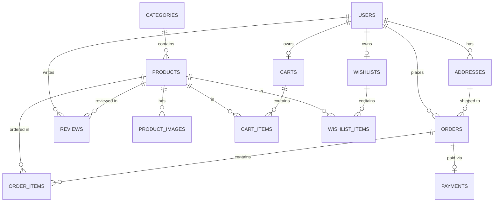

# JPBazaar Development Walkthrough

---

## Phase 1 — Database Architecture

### 1. ER Diagram & Entity Relationships



### 2. Table Schema Definitions (`sql/schema.sql`)
The PostgreSQL schema is established in [`sql/schema.sql`](file:///c:/Users/admin/Desktop/E-COMMERCE/sql/schema.sql) with 13 normalized tables and 15 secondary indexes.

---

## Phase 2 — Spring Boot Foundation

### 1. Maven Configuration (`pom.xml`)
Established Spring Boot 3.3.4 project targeting Java 21 LTS with dependencies:
- `spring-boot-starter-web`
- `spring-boot-starter-data-jpa`
- `spring-boot-starter-security`
- `spring-boot-starter-validation`
- `spring-boot-starter-data-redis`
- `postgresql` (runtime)
- `jjwt-api`, `jjwt-impl`, `jjwt-jackson` (0.12.6)
- `springdoc-openapi-starter-webmvc-ui` (2.6.0)
- `spring-boot-starter-test` & `spring-security-test`

### 2. Package Structure (`com.jpbazaar`)
```
com.jpbazaar
├── config       # OpenApiConfig, SecurityConfig, RedisConfig, JPAConfig
├── controller   # HealthCheckController, AuthController, etc.
├── service      # Business logic & transaction boundaries
├── repository   # Spring Data JPA repositories
├── entity       # JPA domain model
├── dto          # ApiResponse<T>, Request/Response records
├── mapper       # Entity <-> DTO converters
├── security     # JWT filters & SecurityContext utilities
├── exception    # Global exception handler
└── util         # AppConstants
```

### 3. Profile-Based Configuration
- `application.yml`: Base configuration externalized to environment variables (`DB_URL`, `DB_USERNAME`, `DB_PASSWORD`, `REDIS_HOST`, `REDIS_PORT`, `JWT_SECRET`).
- `application-dev.yml`: SQL formatting & debug logging enabled for local development.
- `application-test.yml`: H2 in-memory mode enabled for fast unit testing.

### 4. Build & Test Verification
Run via Maven:
```bash
mvn clean test
```
**Output**: `BUILD SUCCESS`, 1/1 context test passed in 9.6 seconds.

---

## Interview Preparation — Phase 2 Key Technical Questions

### Q1: Why separate `application.yml`, `application-dev.yml`, and `application-test.yml`?
**Answer**: Separation of concerns across environments. Production environment values should strictly come from secure environment variables. `application-dev.yml` enables verbose SQL query logging and `ddl-auto: update` for rapid prototyping. `application-test.yml` uses an isolated in-memory DB (`H2`) so tests execute cleanly without needing an external database.

### Q2: Why use environment variables for database credentials and JWT secrets instead of hardcoding?
**Answer**: Hardcoding credentials creates critical security vulnerabilities (credential leaks in Git repositories). Environment variable injection allows zero-code-change deployments across dev, staging, and production environments following Twelve-Factor App principles.

### Q3: Why use Java 21 Records for DTOs like `ApiResponse<T>`?
**Answer**: Java Records provide immutable data carrier classes with auto-generated getters, `equals()`, `hashCode()`, and `toString()` methods. Immutability guarantees that API payload data cannot be modified unexpectedly once instantiated.

### Q4: How does Spring Boot Auto-Configuration work?
**Answer**: Spring Boot inspects classpath dependencies (e.g. `postgresql` and `spring-boot-starter-data-jpa`) and automatically configures beans like `DataSource`, `EntityManagerFactory`, and `TransactionManager` based on `@EnableAutoConfiguration` (included in `@SpringBootApplication`).
